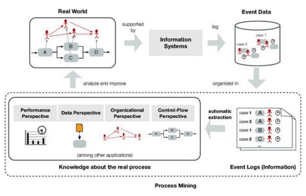
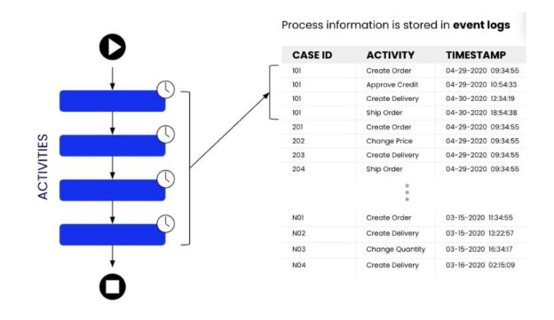
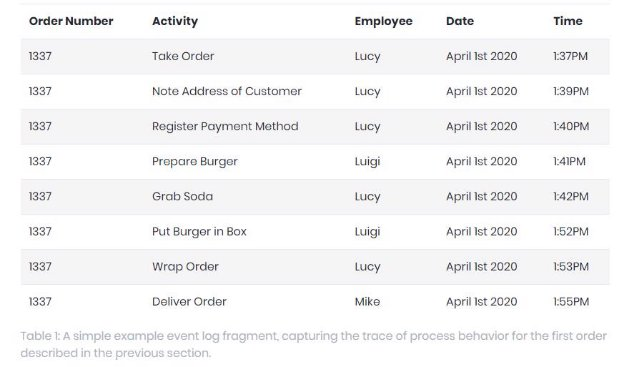
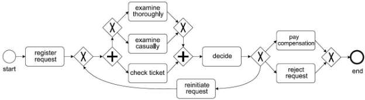
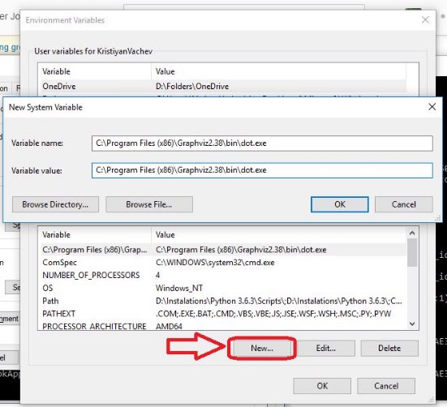
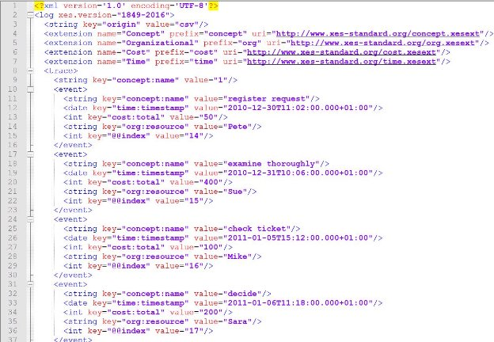
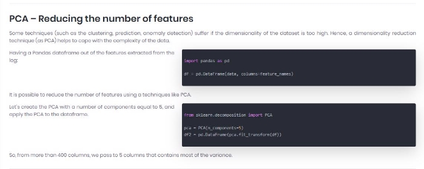



**Process Mining with PM4Py**

1. ***Randy takes your order***
1. ***Randy notes down your preferred payment method***
1. ***Randy notes down your address***
1. ***Luigi prepares your burger***
1. ***Luigi puts your burger in a box***
1. ***Randy wraps your order***
1. ***John delivers your order***

Figure 2: Fundamental elements of the ["Business Process Model and Notation"](http://bpmn.org/), i.e., BPMN, notation, taken from [Process Mining: Data Science in Action; Wil M.P. van der Aalst (2016)](https://www.springer.com/gp/book/9783662498507), page 69

Figure 3: Running example BPMN-based process model describing the behavior of the simple process that we use in this tutorial.

**Install PM4Py**

[**"RuntimeError: Make sure the Graphviz executables are on your system's path" after installing Graphviz 2.38**](https://stackoverflow.com/questions/35064304/runtimeerror-make-sure-the-graphviz-executables-are-on-your-systems-path-aft)

Stack users advice for installation error

My advice for installation

**Loading CSV Files**

|event\_log =|
| - |
|pm4py.format\_dataframe(pd.read\_csv('C:/Users/ALI/Downloads/tamrins/running|
|-example.csv', sep=';'), case\_id='case\_id',|
|activity\_key='activity', timestamp\_key='timestamp')|
|Csv loading|
**Loading XES Files**

log = pm4py.read\_xes('C:/Users/ALI/Downloads/tamrins/running-example.xes') XES loading

XES example dataset

**Pre-Built Event Log Filters**

Filter\_start\_activities

oE

Output as a text

filter\_variants

Output as a text

**Obtaining a Process Model**

Figure 6: BPMN model discovered based on the running example event data set, using the Inductive Miner implementation of PM4Py.

Figure 7: Process Tree model discovered based on the running example event data set, using the Inductive Miner implementation of PM4Py.

Figure 8: Process Map (DFG-based) discovered based on the running example event data set.

Distribution of case duration

Distribution of events over time

**Alpha Miner**

**Directly-Follows Graph**

**Frequency/Performance**

Similar to the Directly-Follows graph

**Rework (activities)**

The rework statistic permits to identify the activities which have been repeated during the same process execution. This shows the underlying inefficiencies in the process.

{'check ticket': 2, 'decide': 2, 'examine casually': 1, 'reinitiate request': 1}

**Rework (cases)**

We define as rework at the case level the number of events of a case having an activity which has appeared previously in the case.

For example, if a case contains the following activities: A,B,A,B,C,D; the rework is 2 since the events in position 3 and 4 are referring to activities that have already been included previously.

{'1': {'number\_activities': 5, 'rework': 0}, '2': {'number\_activities': 5, 'rework': 0}, '3': {'number\_activities': 9, 'rework': 2}, '4': {'number\_activities': 5, 'rework': 0}, '5': {'number\_activities': 13, 'rework': 7}, '6': {'number\_activities': 5, 'rework': 0}}
